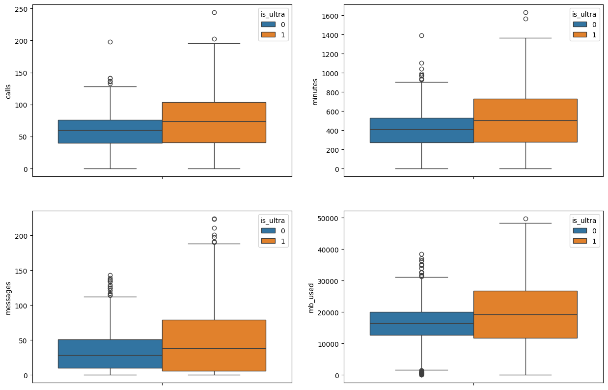
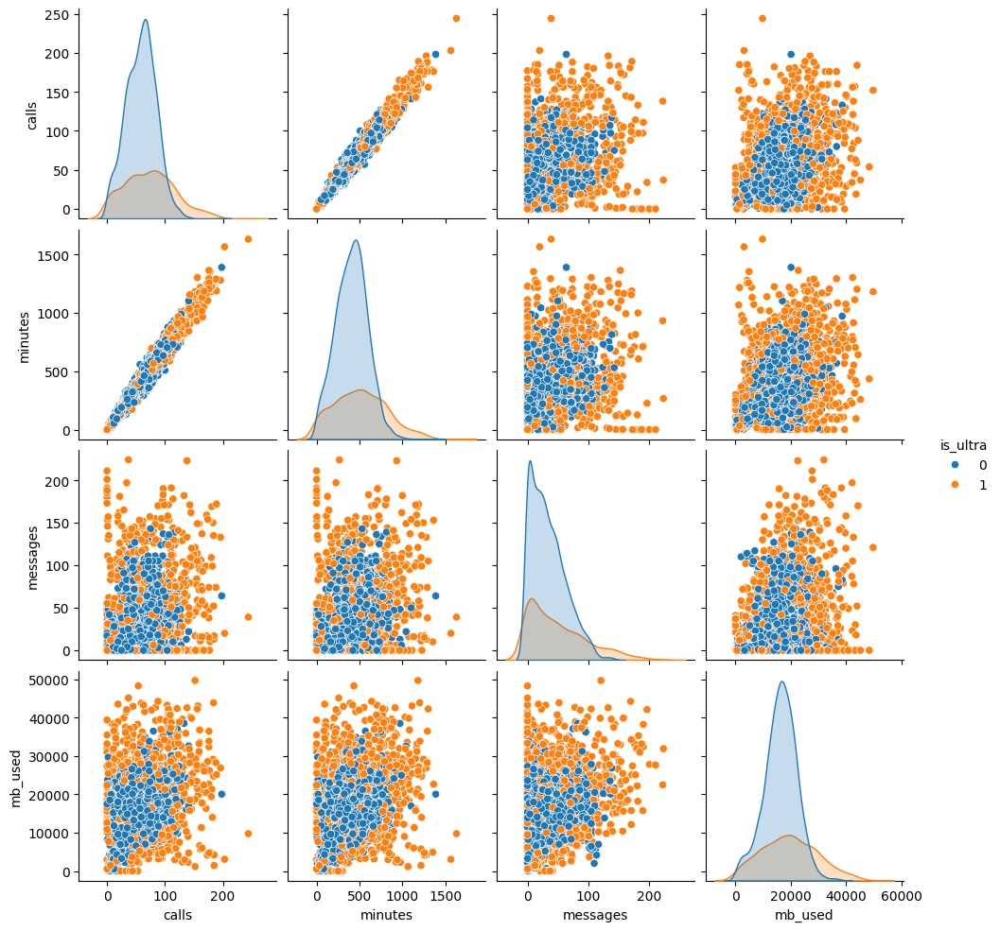
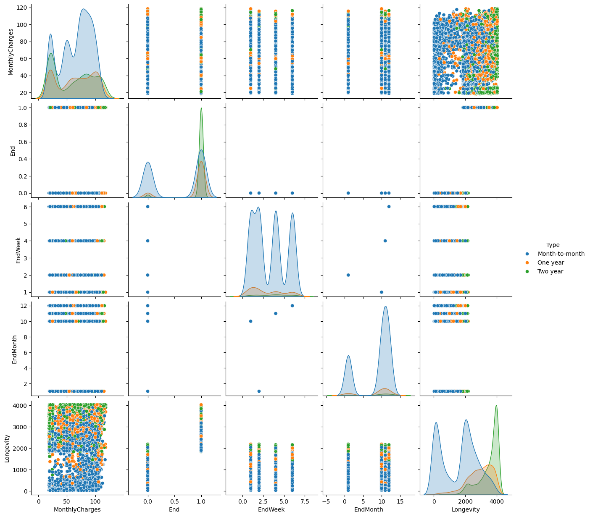
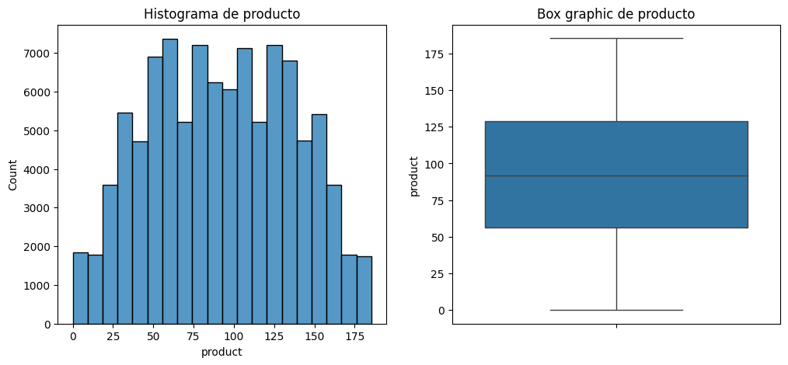
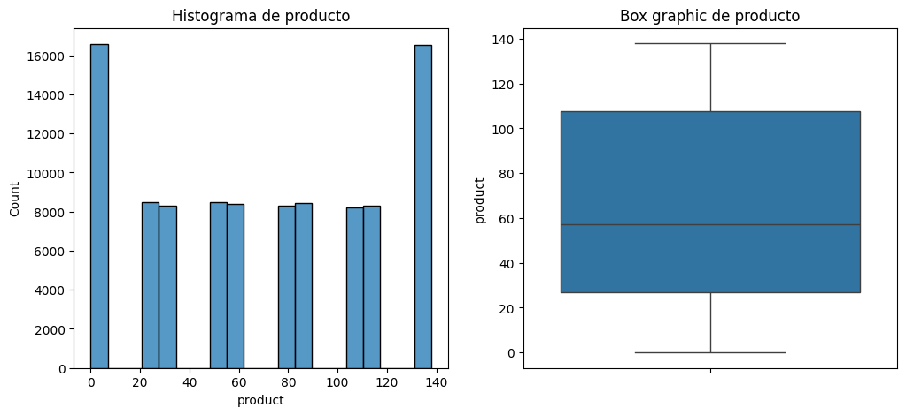
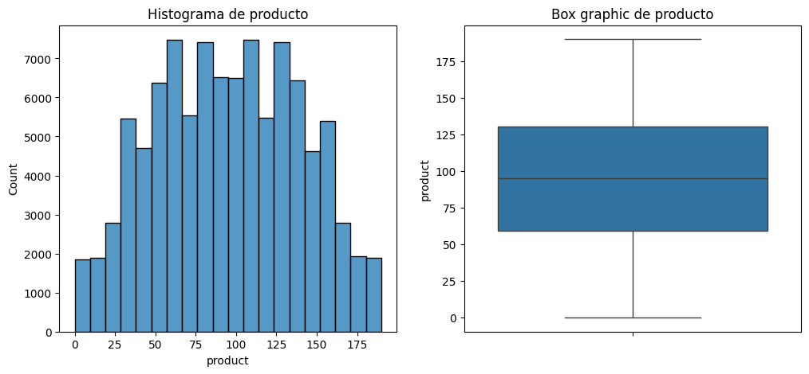
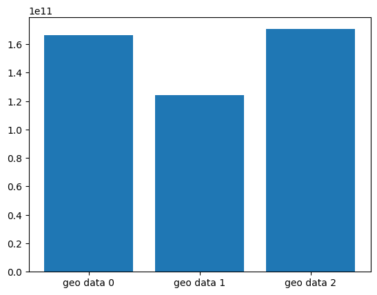

# Acerca de mí

Ingeniero Mecatrónico certificado en Data Science con experiencia en extracción, limpieza y creación de modelos predictivos mediante machine learning.

Genero insights con información, genero modelos predictivos para apoyar en la toma de decisiones y apoyar en procesos, reduciendo tiempo y automatizando procesos, logrando un significativo ahorro de tiempo.

## Habilidades tecnológicas
- Análisis y gestión de datos **Excel / SQL / Python**
- Machine Learning 

## Habilidades blandas

Análisis de datos | Resolución de problemas | Comunicación efectiva | Organización | Proactivo | Autodidacta | Adaptabilidad | Trabajo en equipo |

# Proyectos seleccionados

## Mega Line
Es un sistema de recomendación de nuevos servicios para usuarios de una compañía telefónica, debido a que gran cantidad de usuarios cuentan con paquetes los cuales son heredados y ya tienen mucho tiempo con el mismo servicio.
**Un modelo de recomendación de servicios para los usuarios de MegaLine.**

#### Herramientas y tipo de proyecto
- Python 
- Pandas
- Seaborn
- scikit-learn
- Limpieza de datos
- Transformación de datos
- Analisis de datos
- Modelos de predicción

### Preguntas clave

1. ¿Cuál es el comportamiento de los nuevos usuarios?
2. ¿Qué diferencia hay entre los usuarios que tienen diferentes servicios?
3. ¿Cómo podemos segmentar cada usuario?

### Metodología

- **Preprocesamiento de datos** Se limpiaron los datos, eliminamos inconsistencias y verificamos ausencia de duplicados y valores faltantes.
- **Exploratory Data Analysis (EDA)** Se analizaron características demográficas y de uso, identificando patrones en los clientes.
- **Modelo predictivo** Se entrenaron modelos con regresión logística, bosque aleatorio y árbol de decisiones.

### Conclusiones y recomendaciones

#### Entramiento de los modelos
Todos los modelos nos dieron un score arriba de 85%, exceptuando el de regresión logística, el cual está en 65%.

#### Estrategias recomendadas

Los usuarios ultras tienden a usar más de los servicios, pero son menos personas que los usuarios normales.

### Visualizaciones destacadas
1. **Graficas de caja:** Observación uso promedio de los dos tipos de usuarios.

2. **Grafica de dispersión** de los usuarios ultra y regular.

**Explora más detalles del proyecto en el [repositorio completo](https://github.com/gmacedo22/Best-Plan-Advisor).**

## Smart-Retention
Hay una disminución de usuarios y el equipo de marketing está realizando investigación de los posibles causantes, de los cuales contamos con bastante información.

#### Herramientas y tipo de proyecto
- Python
- Pandas
- Seaborn
- scikit-learn
- Limpieza de datos
- Transformación de datos
- Analisis de datos
- Modelos de predicción

### Preguntas clave
1. ¿Cuáles son los comportamientos de los usuarios que más cancelan el servicio?
2. ¿Qué diferencia a los clientes leales de los que abandonan?
3. ¿Cómo se puede segmentar los clientes para diseñar estrategias personalizadas?

### Metodologia

- **Preprocesamiento de datos** Se limpiaron los datos, eliminamos inconsistencias y verificamos ausencia de duplicados y valores faltantes.
- **Unión de bases de datos** Debido a que tenemos varias fuentes de información, se juntaron para poder sacar el mayor provecho a los datos.
- **Exploratory Data Analysis (EDA)** Se analizaron características demográficas y de uso, identificando patrones en los clientes.
- **Modelo predictivo** Se entrenaron modelos como bosque aleatorio, árbol de decisiones, potenciación de gradiente (LightGBM).

### Conclusiones y recomendaciones

#### Comportamiento de usuarios, Ventas y Marketing

- Los usuarios que cuentan con el servicio de pago mensual tienen mayor tendencia a abandonar el servicio.
- Los usuarios que pagan mes con mes tienden a tener más variación en los pagos.

#### Recomendaciones:

- Dar mayor atención a los usuarios que pagan mensualmente.
- Checar si los usuarios requieren de los servicios que están pagando.
- Segregar mejor los paquetes y los costos.
- Los primeros meses es donde se encuentra la mayor tasa de bajas en el servicio.

### Visualizaciones detacadas

1. **Grafica de disperción** De los diferentes modos de pago y su taza de cancelación

**Explora más detalles del proyecto en el [repositorio completo](https://github.com/gmacedo22/Smart-Retention).**
## Oil Spot Finder
Una empresa quiere realizar una inversión en la excavación de pozos petroleros, los cuales cuentan con información de los espacios a excavar. Quieren saber cuáles son las áreas que les presentarían mayor número de ganancias.

#### Herramientas y tipo de proyecto
- Python
- Pandas
- Seaborn
- scikit-learn
- Limpieza de datos
- Transformación de datos
- Analisis de datos
- Modelos de predicción

### Preguntas claves
1. ¿Qué área presenta mayor retorno de inversión?
2. ¿Cuáles tierras presentan mayor consistencia en los datos?
3. ¿Cuál es el cálculo de riesgo y ganancias para cada región?

### Metodología
- **Preprocesamiento de datos** Se limpiaron los datos, eliminamos inconsistencias y verificamos ausencia de duplicados y valores faltantes.
- **Unión de bases de datos** Debido a que tenemos varias fuentes de información, se juntaron para poder sacar el mayor provecho a los datos.
- **Exploratory Data Analysis (EDA)** Se analizaron características demográficas y de uso, identificando patrones en los clientes.
- **Modelo predictivo**  Se entrenó un modelo de regresión lineal.

### Conclusiones y recomendaciones

#### Comportamiento de las regiones

#### Recomendaciones:
- Hay dos regiones que reportan mayor retorno de inversión.
- El error cuadrático de las regiones no es tan elevado para que presente un riesgo para la inversión.
- La discrepancia de retorno es muy mínima, presentando un riesgo y ganancia bajos.

### Visualizaciones detacadas
1. **Histogramas y graficas de cajas** de cantindad de petroleo encontrado en diferentes areas
**Geo 1**

**Geo 2**

**Geo 3**

**Grafica de Barrras** Ganancias posibles por cada tipo de area

**Explora más detalles del proyecto en el [repositorio completo](https://github.com/gmacedo22/Oil-Spot-Finder).**

**Gracias por visitar mi portafolio. Sigo trabajando en nuevos proyectos, así que si te interesa ver más de mi trabajo, estaré encantado de que vuelvas a visitarlo.** 
